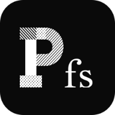

  

# pixelfs

`PixelFS` is a cross-device file management system that simplifies file transfer and management across multiple devices using the `s3-protocol`. It supports operations like copy, move, upload, and download.

## Why Use PixelFS?

- Fast file transfer using the `s3-protocol`, ensuring high-speed synchronization across devices.
- M3U8 streaming support for efficient video playback with hardware decoding.
- WebDAV protocol for easy file access via any WebDAV client.
- Supports common file management commands (`cp`, `mv`, `rm`, `ls`) for a streamlined workflow.
- Automatic synchronization and centralized management across devices, keeping files up-to-date without extra setup.
- Easy installation with minimal configuration needed to get started.

## Documentation

The full documentation is available at https://docs.pixelfs.io.
