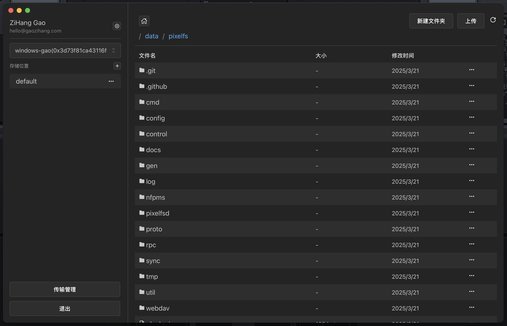
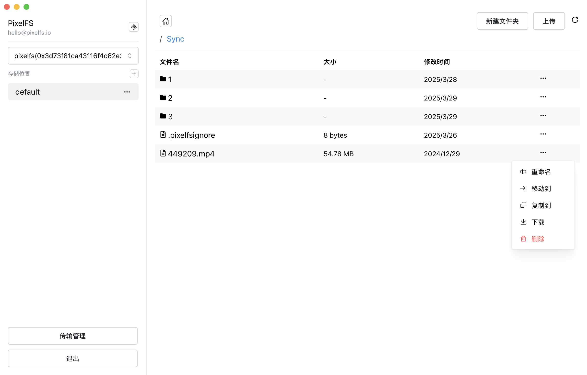

# Quick Start

You can download the `PixelFS` binary from [Releases](https://github.com/pixelfs/pixelfs/releases) and select the version suitable for your operating system and architecture.

## Installing PixelFS

### Desktop Version (GUI) Download

Go to [PixelFS Desktop](https://github.com/pixelfs/pixelfs-desktop/releases) to download the desktop version of `PixelFS`.




### Command Line Installation

::: details Ubuntu/Dedian
```shell
# Download the PixelFS binary (choose the version as needed)
wget https://github.com/pixelfs/pixelfs/releases/download/v1.1.4/pixelfs_1.1.4_linux_amd64.deb

# Install PixelFS
sudo dpkg -i pixelfs_1.1.4_linux_amd64.deb

# Start the PixelFS service (run in user mode)
systemctl --user start pixelfs
systemctl --user enable pixelfs

# Enable lingering session so that the user's services remain running even after the user logs out
loginctl enable-linger
```
:::

::: details CentOS/RHEL
```shell
# Download the PixelFS binary (choose the version as needed)
wget https://github.com/pixelfs/pixelfs/releases/download/v1.1.4/pixelfs_1.1.4_linux_amd64.rpm

# Install PixelFS
sudo rpm -i pixelfs_1.1.4_linux_amd64.rpm

# Start the PixelFS service (run in user mode)
systemctl --user start pixelfs
systemctl --user enable pixelfs

# Enable lingering session so that the user's services remain running even after the user logs out
loginctl enable-linger
```
:::

::: details MacOS
```shell
# Install PixelFS using Homebrew
brew tap pixelfs/tap
brew install pixelfs

# Start the PixelFS service
brew services start pixelfs
```
:::

#### Manual Installation

1. Go to [Releases](https://github.com/pixelfs/pixelfs/releases) and download the `PixelFS` binary suitable for your operating system and architecture.
2. Extract the downloaded file and move the extracted binary to a system path (e.g., /usr/local/bin) or add its directory to your system’s PATH environment variable.

```shell
mv pixelfs /usr/local/bin/
chmod +x /usr/local/bin/pixelfs
```

3. Start the PixelFS daemon (optional):

```shell
pixelfs daemon
```

::: warning
If the `daemon` service is not started, `PixelFS` will not manage files on this device.
:::

## Login

Command: `pixelfs auth login`

After running the command, the terminal will output a login URL, for example:

```text
To authenticate, Please visit:

    https://www.pixelfs.io/auth/cli/d9e5ccb055924bc4d0801a56524766d52f0c26397e9f431abb19ada6be9c16df

Waiting for session...
```

Login steps:
1.	Copy the generated login URL.
2.	Open the URL in a browser and follow the instructions to complete the login process.
3.	Once logged in, the terminal will automatically complete authentication and be ready for use.

## Add a Storage Location

Command: `pixelfs location add`

```shell
pixelfs location add \
    --node-id=0x29e3abdb587207dc4ac9c708670eefde717ef307 \
    --path=/path/to/data \
    --name=location-data
```

Parameter descriptions:

- `--node-id`: Node ID, identifies the storage node.
- `--path`: Path to store data. PixelFS will manage files within this path.
- `--name`: Name of the storage location, must be unique within the same node for easier identification and management.

::: tip
You can use `pixelfs id` to view the Node ID.
:::

## Add S3 Storage Information

Command: `pixelfs storage add`

```shell
pixelfs storage add \
	--type=s3 \
	--region='auto' \
	--endpoint='https://xxxxxx.r2.cloudflarestorage.com' \
	--bucket='pixelfs' \
	--access-key='accessKeyId' \
	--secret-key='secretAccessKey'
```

Parameter descriptions:

- `--type`: Storage type, currently only s3 is supported.
- `--region`: Storage region, auto means automatic selection.
- `--endpoint`: Access URL of the storage node.
- `--bucket`: Name of the storage bucket.
- `--access-key`: Access Key ID.
- `--secret-key`: Secret Access Key.

## Link S3 Storage to a Node

Command: `pixelfs storage link add`

```shell
pixelfs storage link add \
    --node-id=0x29e3abdb587207dc4ac9c708670eefde717ef307 \
    --storage-id=fe0dc5d1-da9f-41e0-a243-3b2582fc3501
```

::: tip
You can use `pixelfs storage ls` to view the added storage IDs.
:::

## Commands

Command: `pixelfs ls`

Command: `pixelfs cd 0x29e3abdb587207dc4ac9c708670eefde717ef307`

```shell
$ pixelfs ls
drw-------    - pixelfs 14 Jan 03:01 0x29e3abdb587207dc4ac9c708670eefde717ef307 ONLINE PIXELFS-NODE
```

## Congratulations!

You’ve successfully completed the `PixelFS` Quick Start Guide 🎉. You can now manage your files efficiently.

For more commands, run `pixelfs --help` or simply type `pixelfs` to explore available options.
